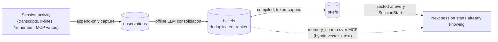
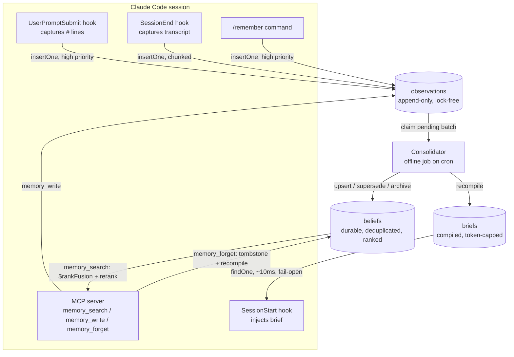
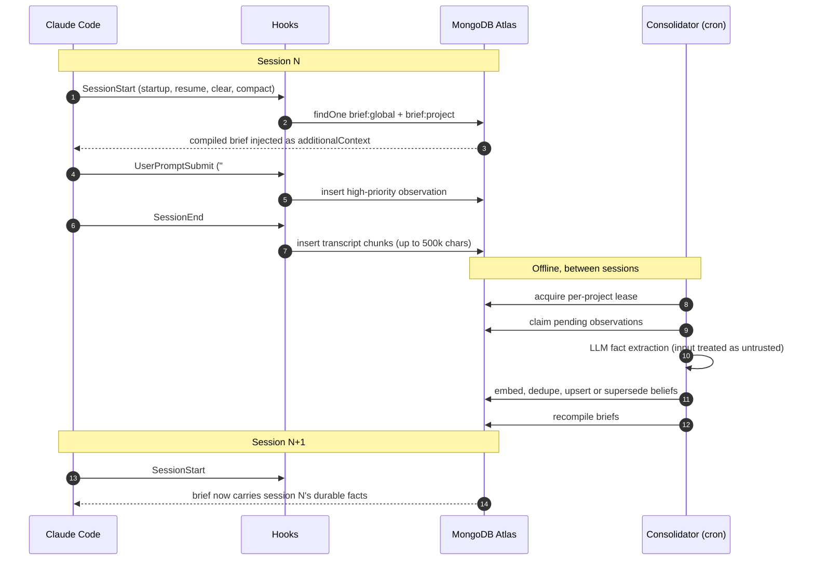
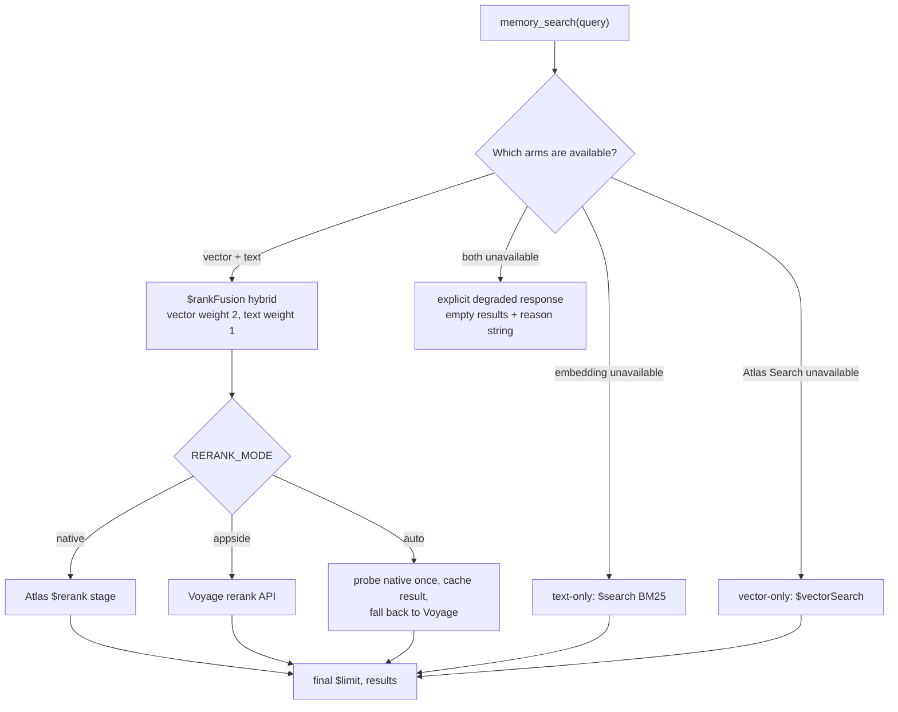
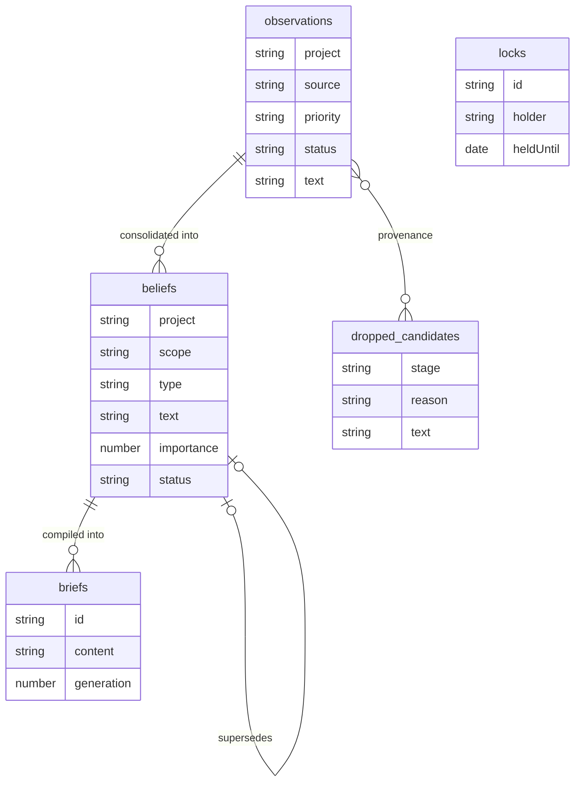
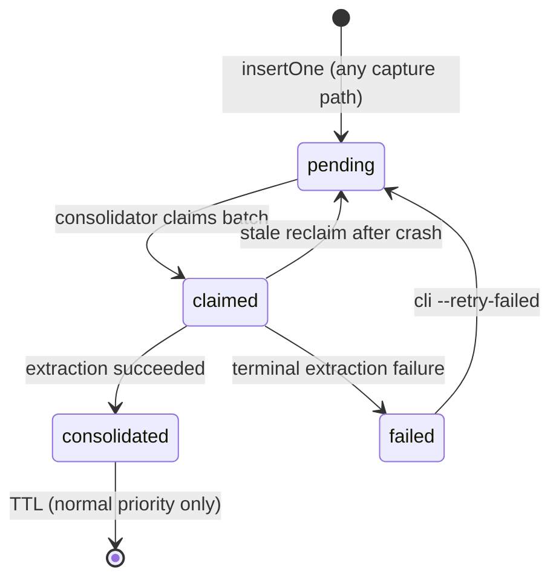
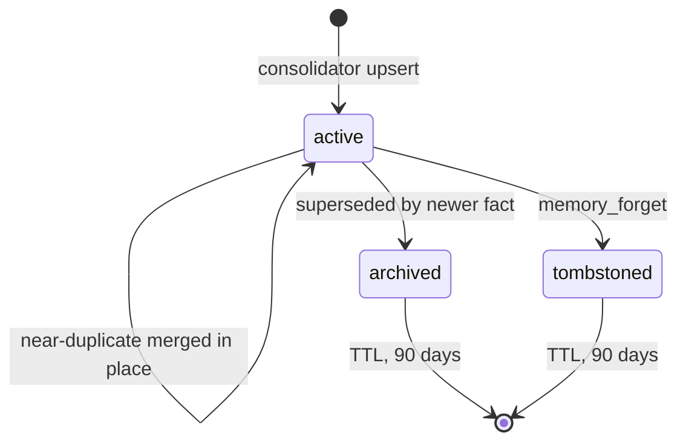
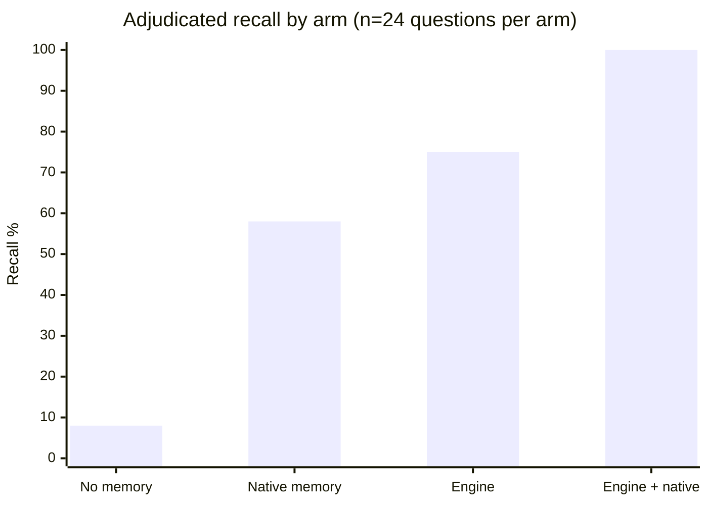

# Recall

**A persistent memory engine for Claude Code, backed by MongoDB Atlas.**

[Documentation site](https://claudecode.mongodbunpacked.com/) · [Design rationale](DESIGN.md) · [Benchmark](#benchmarking-the-memory-gauntlet)

Claude Code's context window is finite. Compaction, and the start of every new session, silently discard whatever it learned, and even when a fact does make it into Claude Code's native file-based auto memory, recall is discretionary: the model may or may not go look. Recall closes that gap. It captures everything a session produces as raw observations, consolidates those observations offline with an LLM into deduplicated, ranked beliefs, and deterministically injects a small, compiled brief at the start of every session, with hybrid vector plus full-text search exposed over MCP for the long tail that does not fit in the brief.

The result is memory that is deterministic at startup (a fixed-size brief is always present, unlike discretionary auto-memory recall), semantically searchable on demand, safe under untrusted input, and correct under concurrent sessions, worktrees, and machines writing at once.

For the full design rationale, verified Atlas capability matrix, and phased implementation plan, see [DESIGN.md](DESIGN.md).

---

## How it works in 60 seconds

1. **Capture.** Every session's activity (the transcript, `#`-prefixed quick notes, `/remember` calls, direct MCP writes) is appended as a raw observation. No judgment happens at this stage: every writer just inserts.
2. **Consolidate.** An offline job, running on a schedule, claims pending observations, uses an LLM to extract durable atomic facts from them, and merges those facts into a deduplicated, ranked set of beliefs.
3. **Inject.** At the start of every session (and again after compaction, clear, or resume), a small, token-capped brief compiled from current beliefs is fetched with a single indexed lookup and injected as context, deterministically, every time, whether or not the model would have thought to look for it.
4. **Search.** For anything that does not fit in the capped brief, an MCP tool exposes hybrid (vector plus full-text) search over the full belief store, on demand.



---

## Contents

<details open>
<summary><strong>Table of contents</strong></summary>

- [Architecture](#architecture)
- [What stays unchanged](#what-stays-unchanged)
- [Quick start](#quick-start)
  - [1. Prerequisites](#1-prerequisites)
  - [2. Install](#2-install)
  - [3. Minimal configuration](#3-minimal-configuration)
  - [4. Index setup](#4-index-setup)
  - [5. Consolidator scheduling](#5-consolidator-scheduling)
- [Day-to-day use](#day-to-day-use)
  - [1. What happens automatically](#1-what-happens-automatically)
  - [2. Explicitly remembering something](#2-explicitly-remembering-something)
  - [3. Recalling something](#3-recalling-something)
  - [4. Forgetting something](#4-forgetting-something)
  - [5. Keeping memory tidy](#5-keeping-memory-tidy)
- [Configuration reference](#configuration-reference)
  - [Embedding modes (`EMBEDDING_MODE`)](#embedding-modes-embedding_mode)
  - [Rerank modes (`RERANK_MODE`)](#rerank-modes-rerank_mode)
  - [LLM provider (`LLM_PROVIDER`)](#llm-provider-llm_provider)
  - [`VOYAGE_BASE_URL`: native Voyage vs. Atlas model API key](#voyage_base_url-native-voyage-vs-atlas-model-api-key)
  - [Credential matrix by combination](#credential-matrix-by-combination)
- [Search pipeline](#search-pipeline)
- [Data model](#data-model)
  - [`observations`](#observations)
  - [`beliefs`](#beliefs)
  - [`briefs`](#briefs)
  - [`locks`](#locks)
  - [`dropped_candidates`](#dropped_candidates)
  - [Lifecycles](#lifecycles)
- [Operations](#operations)
  - [Safety properties](#safety-properties)
  - [Diagnosing silent failures](#diagnosing-silent-failures)
  - [Offline brief cache](#offline-brief-cache)
- [Development](#development)
- [Benchmarking (the memory gauntlet)](#benchmarking-the-memory-gauntlet)
  - [Why a benchmark](#why-a-benchmark)
  - [The four arms](#the-four-arms)
  - [How a run works](#how-a-run-works)
  - [Grading and adjudication](#grading-and-adjudication)
  - [What this design controls for](#what-this-design-controls-for)
  - [Long-horizon coverage](#long-horizon-coverage)
  - [Latest results](#latest-results)
  - [Running it yourself](#running-it-yourself)

</details>

---

## Architecture



Capture is a pure, lock-free append: every writer does an independent `insertOne`, so unlimited concurrent sessions and worktrees never contend. Consolidation is the single place where judgment happens: offline, under a lease, with hindsight. Recall at session start is a single indexed `findOne`: no embedding call, no search, on the hot path. `memory_search` is the on-demand escape hatch for the long tail beyond the capped brief.

Four independent paths append to the `observations` collection, and none of them make any judgment call:

| Path | Trigger | Priority |
|---|---|---|
| SessionEnd transcript (or rolling summary) | End of every session | Normal, subject to `OBSERVATION_TTL_DAYS` |
| `/remember` slash command | Explicit user command | High: the primary, fully reliable user-driven path |
| UserPromptSubmit `#` hash-line | Any prompt starting with `#` | High: best-effort secondary capture (the prompt itself still reaches the model unmodified) |
| MCP `memory_write` | Direct tool call | High |

Every writer does an independent insert, so any number of concurrent sessions, worktrees, or machines can capture at once with zero coordination or lock contention.

A background job, not the interactive session, does the work an in-context model would otherwise have to redo every time. It acquires a per-project lease so only one run touches a given project at once, claims a batch of pending observations, runs an LLM pass to extract durable atomic facts (treating all observation text as untrusted data, never as instructions), embeds each candidate with Voyage's `voyage-4` model, and checks it against existing beliefs via vector-similarity search: a near-duplicate updates the existing belief in place, a contradicting fact supersedes and archives the older one rather than deleting it. It then recompiles the affected project's brief and marks the batch consolidated.

The consolidator materializes one compiled brief per project plus one global brief, a token-capped, ranked prose distillation of current beliefs. A `SessionStart` hook fetches the relevant briefs with a single indexed `findOne`, no embedding call, no search, roughly 10ms, fail-open with a 3 second default budget (`SESSION_START_TIMEOUT_MS`), and injects them; it is wired to session start, compact, and resume, since compaction is exactly when this kind of memory needs to be re-injected. For anything that did not make it into the capped brief, the MCP server exposes `memory_search` (hybrid `$rankFusion` vector plus full-text search, optionally reranked, falling back gracefully if Voyage or Atlas Search is unavailable) as an on-demand escape hatch, alongside `memory_write` for direct capture and `memory_forget` for tombstoning a belief by id (scoped to the caller's own project) and immediately recompiling the brief so the forgotten belief stops being injected at the next session.



---

## What stays unchanged

This system integrates through Claude Code's public extension points only, so it is worth being explicit about the boundary: everything below keeps behaving exactly as it does in stock Claude Code.

- **Claude Code itself is not modified, forked, wrapped, or proxied.** Integration is entirely through official extension points: hooks registered in `settings.json`, an MCP server, and a `/remember` slash command. Removing those three registrations returns Claude Code to stock behavior with zero residue.
- **`CLAUDE.md` keeps working exactly as before.** This system does not read, move, or replace hand-written `CLAUDE.md` instructions (root or nested). It replaces only Claude Code's learned auto memory (the `MEMORY.md` index and topic files), the discretionary recall path, not the instructional one.
- **The conversation loop, model selection, permissions and approval model, other tools, and compaction behavior are untouched.** This system only adds context at `SessionStart` (re-injected on compact and resume) and offers three optional MCP tools (`memory_search`, `memory_write`, `memory_forget`); it changes nothing else about how a session runs.
- **Failure isolation is total.** If MongoDB, Voyage, or the LLM provider is unreachable, all three hooks fail open and exit `0`, so a session behaves like stock Claude Code plus, at most, a missing brief. `memory_search` degrades to an explicit empty or degraded result rather than throwing.
- **No data leaves infrastructure the user chose.** Memory lives only in the user's own Atlas cluster, and embedding, rerank, and fact-extraction calls go only to the providers the user configured (Voyage or the Atlas model API, Anthropic, Bedrock, or a local Ollama model).

> [!NOTE]
> This does not fix in-session context bloat or autocompact thrashing. If a single oversized tool read or command output fills the context window and triggers repeated auto-compaction, that is a within-session token-budget problem (one read or output too large for the window), not the cross-session memory-loss problem this system solves. The fix for that is smaller reads or `/clear`, not a bigger model and not this memory engine: the brief injected at `SessionStart` here is capped at `BRIEF_CORE_TOKEN_CAP` plus `BRIEF_PROJECT_TOKEN_CAP` (800 plus 1200 tokens by default), a small, fixed addition that neither causes nor cures that failure mode.

---

## Quick start

### 1. Prerequisites

- Node.js (see `package.json` for toolchain; TypeScript 5.7, compiled to `dist/`)
- A MongoDB Atlas cluster (Atlas Search and Atlas Vector Search require Atlas, not a self-managed deployment)
- A Voyage AI API key, or a MongoDB Atlas model API key (the Atlas Embedding and Reranking API), for embeddings and reranking
- An Anthropic API key, AWS credentials for Bedrock, or a local Ollama server, for the consolidator's fact-extraction LLM call

### 2. Install

**Recommended: install as a plugin**

```bash
claude plugin marketplace add saiteja05/mongo-claude-memory
claude plugin install recall
```

`dist/` ships pre-built inside the plugin, so no build step is needed after install. The plugin's own dependencies still need a one-time install: find the resolved install directory with `claude plugin list --json` (the `installPath` field), then run `npm install` inside it once. This registers the hooks, the MCP server, and the `/remember`, `/recall-status`, and `/recall-doctor` commands automatically.

> [!TIP]
> The `recall-setup` skill walks through this end to end (finding the install directory, running that one-time `npm install`, configuring credentials, and verifying connectivity). Run it once right after installing the plugin, instead of following the manual steps below by hand.

<details>
<summary><strong>Manual install (without the plugin)</strong></summary>

Clone the repo and build it locally instead of using the plugin:

```bash
git clone https://github.com/saiteja05/mongo-claude-memory
cd mongo-claude-memory
npm install
npm run build
```

Then wire the following hooks into Claude Code's settings (`hooks` in `settings.json`), pointing at the built `dist/` entry points:

- `SessionStart`, matched with `"startup|resume|clear|compact"`, running `node dist/hooks/sessionStart.js`. This is what re-injects the brief after a compaction, a `/clear`, or a resume, not only at the very first launch.
- `UserPromptSubmit`, running `node dist/hooks/userPromptSubmit.js`, to capture prompts whose first non-whitespace character is `#` as high-priority observations.
- `SessionEnd`, running `node dist/hooks/sessionEnd.js`, to capture a transcript summary as an observation.

All three hooks fail open unconditionally: any error, timeout, or missing configuration results in a silent no-op and a normal `exit(0)`, never a visible hook failure.

A `/remember` slash command is provided at `.claude/commands/remember.md`; it writes the exact argument text to a temp file (to avoid shell-quoting issues) and invokes `node dist/capture/remember.js --file <path>`, which writes a high-priority observation with `source: "remember"`.

Register the MCP server (`node dist/mcp/server.js`, stdio transport) to expose `memory_search`, `memory_write`, and `memory_forget` as tools. It reads the same environment variables as the hooks and resolves a default project key from the working directory it is launched in.

</details>

### 3. Minimal configuration

```bash
export MDB_MCP_CONNECTION_STRING="mongodb+srv://..."
export VOYAGE_API_KEY="..."
export ANTHROPIC_API_KEY="..."
```

Strictly, only the connection string is mandatory: every other variable has a sane default and the system degrades gracefully when one is absent (capture and brief injection keep working without the Voyage or LLM keys; only consolidation and search need them). The full table is under Configuration reference below. All configuration is loaded by `loadConfig()` in `src/config.ts`.

### 4. Index setup

```bash
npm run setup:indexes
```

Run once against a fresh Atlas database, and safely re-run at any time (every step checks for existing state before creating anything). This creates the five collections if missing, the observation TTL index, the dropped-candidate TTL index, the beliefs compound index and archival TTL index, the vector search index matching the current `EMBEDDING_MODE` (`beliefs_vec` for app-side embeddings, `beliefs_vec_auto` for Atlas `autoEmbed`, only one is created, not both), and the `beliefs_text` BM25 search index. Search-index creation failures (for example, a Preview feature not enabled on a given cluster) are logged and skipped without blocking the rest of setup.

If you installed the plugin, run this from the resolved install directory (`claude plugin list --json`, the `installPath` field), not the plugin source repo.

### 5. Consolidator scheduling

This step is unaffected by which install path you used: cron or a trigger calls the same `dist/consolidation/cli.js` entry point either way. If you are scheduling against a plugin-installed copy rather than a manual clone, find the resolved directory first with `claude plugin list --json` (the `installPath` field) and use that path in place of `/path/to/mongo-claude-memory` below.

The consolidator (`node dist/consolidation/cli.js`) is a cron/trigger entry point, not a hook: unlike the hooks, it prints normal progress output and can exit non-zero on a genuine crash. Example crontab line, running every 15 minutes:

```
*/15 * * * * cd /path/to/mongo-claude-memory && /usr/bin/env node dist/consolidation/cli.js >> /var/log/mongo-claude-memory-consolidate.log 2>&1
```

Invoked with no arguments, it discovers and processes every project with pending observations. Pass a project key as a positional argument to process a single project.

---

## Day-to-day use

Once the hooks and MCP server are registered (see Quick start above), day-to-day use has four modes: things that happen without you doing anything, explicitly saving a fact, recalling something on demand, and forgetting something. A fifth section covers the maintenance job that turns raw capture into durable memory.

### 1. What happens automatically

Nothing to configure per session. Three hooks run without any user action:

- **`SessionStart`** (startup, resume, clear, compact): fetches `brief:global` and `brief:<project>` with a single `findOne` each and injects their combined `content` as `additionalContext`. Conceptually, the injected brief reads like a short paragraph of standing facts and conventions, for example "Prefers pnpm over npm. This repo's CI gate is `npm run build && npm test`. Uses Bedrock in prod, Anthropic API in dev." It is capped at `BRIEF_CORE_TOKEN_CAP` (800 tokens, global) plus `BRIEF_PROJECT_TOKEN_CAP` (1200 tokens, per project), so it is always a small, fixed-size block, not the full memory store. If the live fetch times out or errors, it falls back to a local cache of the last successfully fetched brief (see Offline brief cache under Operations); a healthy fetch that legitimately finds nothing never touches that cache.
- **`UserPromptSubmit`**: any prompt whose first non-whitespace character is `#` is captured as a high-priority observation (`source: "hash_line"`), the same mechanism Claude Code's own quick-add uses. For example typing `# always run migrations before seeding` writes that line to `observations`; the prompt still passes through to Claude unmodified.
- **`SessionEnd`**: captures the session transcript as one or more 50,000-character chunk observations (`source: "transcript"`), for the consolidator to later extract facts from, up to a total budget of `TRANSCRIPT_CAPTURE_MAX_CHARS` (500,000 characters by default, ten chunks). When a session's transcript exceeds that budget, the first chunk and the most recent chunks are kept, so a session's early decisions and its most recent outcomes both survive; the chunks in between are dropped, with only their combined character count logged, never their content. Each chunk carries its session id and its `chunk_index`/`chunk_count` position into extraction. Capture volume is sized independently of any model's context window: the two are separate constraints, and a large transcript capture is handled on the extraction side by the model-aware batch budget described under Diagnosing silent failures. Before writing, it strips any exact occurrence of the currently injected brief content from the full transcript, before chunking (echo-loop defense: the injected brief is memory output, not new evidence).

All three hooks fail open: if MongoDB is unreachable or misconfigured, they no-op silently and exit `0`. You will never see a memory-path error surface in a session.

### 2. Explicitly remembering something

Two ways to write a fact directly, both landing in `observations` as high-priority (never expire, never subject to `OBSERVATION_TTL_DAYS`):

**`/remember` slash command**, typed in Claude Code:

```
/remember always run migrations before seeding the dev database
```

This writes the argument text to a temp file, then runs `node dist/capture/remember.js --file <path>`, which resolves the project key from the current working directory and writes an observation with `source: "remember"`. On success it prints `Saved to memory (project: <project>).`

**`memory_write` MCP tool**, for Claude to call on your behalf mid-conversation:

```json
{
  "tool": "memory_write",
  "arguments": {
    "text": "This repo's CI gate is npm run build && npm test",
    "project": "mongo-claude-memory"
  }
}
```

`project` and `session_id` are optional and default to the server's resolved project key and `"mcp:memory_write"` respectively. Either path writes only an observation, never a belief directly: only the offline consolidator promotes an observation into a durable, ranked belief.

### 3. Recalling something

The always-injected brief is the first, free recall path; `memory_search` is the on-demand tool for anything that did not fit in the brief's token cap. A user would just ask a natural question:

> "What did we decide about the rerank fallback order?"

and Claude calls the tool itself:

```json
{
  "tool": "memory_search",
  "arguments": {
    "query": "rerank fallback order",
    "project": "mongo-claude-memory",
    "scope": "project",
    "limit": 5
  }
}
```

| Parameter | Required | Notes |
|---|---|---|
| `query` | yes | Free-text search string |
| `project` | no | Defaults to the MCP server's resolved project key |
| `scope` | no | `core`, `project`, or `archive`; unset searches without a scope filter |
| `limit` | no | Defaults to 8 |

The response is:

```json
{
  "results": [
    { "_id": "...", "text": "...", "scope": "project", "type": "convention", "importance": 0.8, "score": 0.71 }
  ],
  "degraded": null
}
```

`degraded` is `null` on a full hybrid ($rankFusion vector + BM25, optionally reranked) run. If part of the pipeline is unavailable it becomes a short reason string instead of throwing, for example `"vector-only: Atlas Search unavailable"`, `"text-only: vector search unavailable"`, or, if everything fails, `"unavailable: memory search failed on every path"` with an empty `results` array.

### 4. Forgetting something

```json
{
  "tool": "memory_forget",
  "arguments": {
    "beliefId": "665f1a2b3c4d5e6f7a8b9c0d",
    "project": "mongo-claude-memory"
  }
}
```

This does not hard-delete anything. It sets that belief's `status` to `"tombstoned"`, bumps `version`, and updates `updated_at`, filtered on both `_id` and `project` so a caller cannot tombstone another project's belief by guessing an id, then immediately recompiles the affected brief(s) so the belief stops being injected at the very next `SessionStart`. A tombstoned belief is excluded from the brief and from `memory_search` results, and is hard-deleted only later, by the partial TTL index, 90 days after tombstoning.

Forgetting a belief in a project other than the MCP server's resolved one is rejected by default (destructive writes stay scoped to the project you are working in); set `MEMORY_MCP_ALLOW_CROSS_PROJECT=1` to allow it. `memory_search` and `memory_write` are unrestricted either way (reads and appends are low-risk).

### 5. Keeping memory tidy

Observations pile up from capture; the consolidator (`node dist/consolidation/cli.js`) is the offline job that turns them into deduplicated, ranked beliefs and recompiles the brief. It is a cron/trigger entry point, not a hook, so it prints normal output and exits non-zero on a genuine failure. See Consolidator scheduling above for the recommended cron line (every 15 minutes).

```bash
# Process every project with pending observations
node dist/consolidation/cli.js

# Process a single project only
node dist/consolidation/cli.js mongo-claude-memory
```

A run acquires a per-project lease, claims a batch of pending observations, extracts facts with the configured LLM, embeds and vector-dedupes them against existing beliefs, upserts (or supersedes/archives) beliefs, recompiles the affected brief, and marks the batch consolidated. A candidate fact that scores below the dedupe threshold but still close to an existing active belief (above `CONSOLIDATION_RECONCILE_THRESHOLD`, default 0.75) is not inserted outright: a small LLM arbitration call judges it against each such near neighbor, archiving and superseding a contradicted belief, merging into a duplicate, or falling through to a plain insert when the neighbor is unrelated or the arbitration call itself fails. This write-time reconciliation only runs when there is at least one near neighbor to check, so a genuinely new fact costs nothing extra.

**Preview without writing anything:**

```bash
node dist/consolidation/cli.js mongo-claude-memory --dry-run
```

Runs the same extraction and dedup logic and reports what would change, without touching `beliefs`, `briefs`, or observation status.

**Check health:**

```bash
node dist/consolidation/cli.js --status
```

Reports pending/claimed/consolidated/failed observation counts, stale-claim counts, current lock/lease state, belief counts by project and status, quarantined dropped-candidate counts by project and stage, and brief metadata, all as a point-in-time snapshot. No LLM call.

**Undo a bad run:**

```bash
node dist/consolidation/cli.js --rollback --run-id <id>
```

(or `--rollback <id>` as a bare positional). Reverts the belief and brief changes made by that specific run, using each belief's provenance (`observation_ids`, `supersedes`, `generation`). Find the run id in the consolidator's own log output or via `--status`.

**Heal contradictory or duplicate active beliefs:**

```bash
node dist/consolidation/cli.js --reconcile mongo-claude-memory
```

Sweeps the named project's active beliefs pairwise by similarity, has the LLM arbitrate each pair it finds (the belief backed by newer evidence survives), and archives the superseded or duplicate older belief, recompiling affected briefs and, for duplicates, merging provenance onto the survivor. Bounded by `CONSOLIDATION_RECONCILE_MAX_PAIRS` LLM calls per run (default 25); requires LLM credentials, unlike `--status`. This is the retroactive counterpart to the write-time reconciliation described above: use it to heal beliefs that predate that check or slipped past it. A project argument is required; there is no all-projects mode for `--reconcile`.

---

## Configuration reference

The variables most deployments set:

| Variable | Purpose |
|---|---|
| `MDB_MCP_CONNECTION_STRING` (or `MEMORY_MONGODB_URI`) | Atlas connection string |
| `VOYAGE_API_KEY` | Embeddings and rerank |
| `ANTHROPIC_API_KEY` / `LLM_PROVIDER` | Fact-extraction LLM and which provider to use |
| `EMBEDDING_MODE` | `appside` (default) or `auto` |
| `RERANK_MODE` | `auto` (default), `native`, or `appside` |

<details>
<summary><strong>All environment variables</strong></summary>

| Variable | Default | Notes |
|---|---|---|
| `MDB_MCP_CONNECTION_STRING` | none | Preferred connection string source (shared with the MongoDB MCP plugin). Required unless `MEMORY_MONGODB_URI` is set. |
| `MEMORY_MONGODB_URI` | none | Fallback connection string if the MCP-shared one is not set. One of these two is mandatory. |
| `MEMORY_MONGODB_DB` | `claude_memory` | Database name |
| `VOYAGE_API_KEY` | none | Voyage AI (or Atlas model API) key. Absent is tolerated at load time; embedding/read paths handle its absence by degrading, never crashing. |
| `VOYAGE_MODEL` | `voyage-4` | Embedding/rerank model |
| `VOYAGE_DIMENSIONS` | `1024` | Embedding dimensionality |
| `VOYAGE_BASE_URL` | `https://api.voyageai.com` | Set to `https://ai.mongodb.com` to use an Atlas model API key instead of a native Voyage key |
| `BRIEF_CORE_TOKEN_CAP` | `800` | Token cap for the global (`core`) brief |
| `BRIEF_PROJECT_TOKEN_CAP` | `1200` | Token cap for the per-project brief |
| `BRIEF_CACHE_MAX_AGE_DAYS` | `7` | Max age of the local brief cache served when Atlas is unreachable; 0 disables cache reads |
| `SESSION_START_TIMEOUT_MS` | `3000` | Fail-open budget for `SessionStart`'s brief fetch. When unset, falls back to `HOOK_INTERNAL_TIMEOUT_MS` if that is set, else 3000 (cold Atlas connects need more than the 800ms general default) |
| `HOOK_INTERNAL_TIMEOUT_MS` | `800` | General hook-internal fail-open default; also the `SessionStart` fallback when `SESSION_START_TIMEOUT_MS` is unset |
| `HOOK_WRITE_TIMEOUT_MS` | `5000` | Budget for the `UserPromptSubmit` hash-line capture write. Explicit remember requests get a longer budget so an in-flight insert is not killed mid-write |
| `OBSERVATION_TTL_DAYS` | `30` | TTL for normal-priority observations |
| `DROPPED_CANDIDATE_TTL_DAYS` | `30` | Retention for quarantined dropped candidate facts |
| `SESSION_END_TIMEOUT_MS` | `5000` | Fail-open budget for the `SessionEnd` hook |
| `TRANSCRIPT_CAPTURE_MAX_CHARS` | `500000` | Total `SessionEnd` transcript capture budget in characters, chunked into 50k observations with the first chunk plus most recent kept |
| `ANTHROPIC_API_KEY` | none | Required for fact extraction when `LLM_PROVIDER=anthropic` |
| `ANTHROPIC_MODEL` | `claude-sonnet-5` | Extraction model |
| `LLM_PROVIDER` | `anthropic` | `anthropic`, `bedrock`, or `ollama` |
| `LLM_TIMEOUT_MS` | `60000` | Hard wall-clock cap per LLM call attempt (fact extraction), Anthropic and Bedrock alike |
| `BEDROCK_MODEL` | `us.anthropic.claude-haiku-4-5-20251001-v1:0` | Cross-region inference profile ID, used when `LLM_PROVIDER=bedrock` |
| `AWS_REGION` / `BEDROCK_REGION` | `us-east-1` | AWS region for the Bedrock Converse API |
| `OLLAMA_BASE_URL` | `http://localhost:11434` | Ollama server address, used when `LLM_PROVIDER=ollama` |
| `OLLAMA_MODEL` | `llama3.1` | Model name to call for fact extraction when `LLM_PROVIDER=ollama`; must be pulled locally and support tool/function calling |
| `OLLAMA_CONTEXT_TOKENS` | `8192` | Context window, in tokens, requested from the local Ollama server for extraction calls (`num_ctx`), and the value used to size the extraction batch for it (see `CONSOLIDATION_BATCH_MAX_CHARS`); minimum `1024` |
| `CONSOLIDATION_LEASE_MS` | `300000` | Per-project consolidation lease duration |
| `CONSOLIDATION_BATCH_SIZE` | `50` | Observations claimed per run (document count bound) |
| `CONSOLIDATION_BATCH_MAX_CHARS` | model-aware, unset by default | Total text-length budget per claimed batch; at least one observation is always taken. Bounds the extraction prompt in characters, since a count-only bound can exceed the model's context limit on large transcript observations. When unset, defaults to a value derived from the configured consolidation model's context window (200k tokens for Anthropic and Bedrock's Anthropic cross-region profiles, `OLLAMA_CONTEXT_TOKENS` for Ollama), rather than one fixed number regardless of provider; an explicit setting here always wins |
| `CONSOLIDATION_RECLAIM_MS` | `600000` | Age after which a stale `claimed` observation is reclaimed to `pending`; also the age at which a crashed run's project is rediscovered by the no-argument consolidator |
| `CONSOLIDATION_BELIEFS_CONTEXT_LIMIT` | `30` | Existing beliefs passed to the LLM as dedup/context (most recently updated first) |
| `CONSOLIDATION_DEDUPE_THRESHOLD` | `0.93` | Vector similarity threshold above which a candidate fact is treated as a duplicate of an existing belief |
| `CONSOLIDATION_RECONCILE_THRESHOLD` | `0.75` | Similarity floor for the write-time reconciliation probe; 1 disables reconciliation entirely |
| `CONSOLIDATION_RECONCILE_MAX_PAIRS` | `25` | Cap on LLM arbitration calls per `--reconcile` sweep |
| `EMBEDDING_MODE` | `appside` | `appside` or `auto` (see Embedding modes below) |
| `RERANK_MODE` | `auto` | `auto`, `native`, or `appside` (see Rerank modes below) |
| `MEMORY_PROJECT_KEY_MODE` | `path` | `path` keys memory by the local `.git` directory path (stable per machine/clone); `remote` keys by the normalized `remote.origin.url`, so every clone on every machine shares one key. Switching modes re-keys project memory: beliefs stored under the old key stay there. `remote` falls back to `path` when there is no origin remote |
| `MEMORY_MCP_ALLOW_CROSS_PROJECT` | unset | Set to `1` to allow `memory_forget` to tombstone beliefs in a project other than the MCP server's resolved one. Off by default; `memory_search` and `memory_write` are unrestricted either way |
| `MEMORY_FAILURE_LOG` | `~/.mongo-claude-memory/failures.log` | Destination for the silent-failure telemetry log (see Diagnosing silent failures) |

</details>

### Embedding modes (`EMBEDDING_MODE`)

| Mode | Behavior | Requires |
|---|---|---|
| `appside` (default) | The application computes 1024-dim `voyage-4` vectors and stores them on the belief document; queries are embedded app-side with `input_type=query`. | `VOYAGE_API_KEY` (or an Atlas model API key via `VOYAGE_BASE_URL`) |
| `auto` | Atlas `autoEmbed` (Preview) computes and stores the embedding server-side from the belief's `text` field on write, via the `beliefs_vec_auto` index; queries are also embedded server-side, via `query: { text: "..." }` passed to `$vectorSearch` against the same index; the app computes no vectors at all in this mode. | Atlas org must have `autoEmbed` enabled; Preview write cap is 2,000 RPM |

Both modes are live, but `setup:indexes` only creates the index for the currently configured mode (to avoid paying for embedding computation in both places at once): switching `EMBEDDING_MODE` requires re-running `npm run setup:indexes` to create the newly needed index, a one-time idempotent step, not a migration. `autoEmbed` is a Preview feature with per-model query rate limits (3 requests/minute per model), which is why `appside` is the default for high-frequency, hot-path search: `auto` is a better fit for lower-volume or non-latency-sensitive deployments.

### Rerank modes (`RERANK_MODE`)

| Mode | Behavior | Requires |
|---|---|---|
| `auto` (default) | Probes the native Atlas `$rerank` stage once and caches the result; falls back to the Voyage rerank API on failure. | `VOYAGE_API_KEY` for the fallback path; Atlas 8.3+ with `$rerank` enabled in project settings for the native path |
| `native` | Always uses the Atlas `$rerank` stage. | Atlas 8.3+ (auto-upgrade track), `$rerank` enabled in Project Settings |
| `appside` | Always uses the application-side Voyage `rerank()` API. | `VOYAGE_API_KEY` |

### LLM provider (`LLM_PROVIDER`)

| Provider | Behavior | Requires |
|---|---|---|
| `anthropic` (default) | Direct Anthropic API call for fact extraction, with forced tool choice. | `ANTHROPIC_API_KEY` |
| `bedrock` | AWS Bedrock Converse API, using a cross-region inference profile ID. | AWS credentials resolvable in the environment (standard AWS SDK credential chain), `AWS_REGION`/`BEDROCK_REGION` |
| `ollama` | A local Ollama server call for fact extraction, no forced tool choice (Ollama has no equivalent to Anthropic/Bedrock's forced tool_choice, so extraction reliability depends on the chosen model's own function-calling quality). Free and fully local: no API key or cloud credentials needed. | None; requires `ollama serve` running locally with `OLLAMA_MODEL` already pulled (`ollama pull llama3.1`) |

Ollama here only replaces the consolidator's fact-extraction LLM call: embeddings and reranking still require Voyage (or the Atlas model API) regardless of which `LLM_PROVIDER` is chosen, so a fully local, zero-API-key setup end to end is not yet available.

### `VOYAGE_BASE_URL`: native Voyage vs. Atlas model API key

| `VOYAGE_BASE_URL` | Credential type |
|---|---|
| `https://api.voyageai.com` (default) | A native Voyage AI API key |
| `https://ai.mongodb.com` | An Atlas Embedding and Reranking API key (no separate Voyage account needed) |

### Credential matrix by combination

| Configuration | Credentials needed |
|---|---|
| `EMBEDDING_MODE=appside`, `RERANK_MODE=appside`, native Voyage | `VOYAGE_API_KEY` against `api.voyageai.com` |
| `EMBEDDING_MODE=appside`, `RERANK_MODE=appside`, Atlas model API | `VOYAGE_API_KEY` set to an Atlas model API key, `VOYAGE_BASE_URL=https://ai.mongodb.com` |
| `EMBEDDING_MODE=auto`, `RERANK_MODE=auto` | `VOYAGE_API_KEY` for query embedding and rerank fallback (write-path embedding is server-side and needs no app credential); Atlas org enablement for `autoEmbed` and `$rerank` |
| Any embedding/rerank mode + `LLM_PROVIDER=anthropic` | Add `ANTHROPIC_API_KEY` |
| Any embedding/rerank mode + `LLM_PROVIDER=bedrock` | Add AWS credentials in the environment; no `ANTHROPIC_API_KEY` needed |
| Any embedding/rerank mode + `LLM_PROVIDER=ollama` | Requires a local Ollama server reachable at `OLLAMA_BASE_URL` with `OLLAMA_MODEL` pulled; no `ANTHROPIC_API_KEY` or AWS credentials needed for the LLM step, Voyage credentials are still required for embeddings/rerank |

---

## Search pipeline

`memory_search` (exposed over MCP) is the on-demand, long-tail retrieval path; the always-injected brief remains the primary, free recall path for anything that fits in the token cap.

1. **Hybrid fusion**: a single `$rankFusion` aggregation stage (GA on MongoDB 8.0+) fuses a `$vectorSearch` arm (`beliefs_vec`, filtered on `project`/`scope`/`status`) and a `$search` BM25 arm (`beliefs_text`, same filters), combined with weights `{vector: 2, text: 1}`. In `appside` mode, the query vector is computed app-side with `voyage-4` (`input_type=query`). In `auto` mode, the vector arm instead targets `beliefs_vec_auto` with `query: { text: "..." }`, and no app-side query vector is computed at all.
2. **Rerank**: the fused top candidates are optionally reranked for precision, per `RERANK_MODE` above, before the final `$limit`. The fusion score is projected to a named field before reranking, since `$rerank` overwrites `{$meta:"score"}`.
3. **Never-throw degradation ladder**: if Voyage embedding is unavailable, the vector arm is dropped and the query proceeds text-only; if Atlas Search is unavailable, it proceeds vector-only; if both fail, the result is an explicit empty, degraded response rather than a thrown error. No memory-search failure is ever allowed to surface as a session-derailing error.



---

## Data model

Five collections, defined in `src/db/schema.ts`.



### `observations`

Raw, high-volume capture. Append-only; never updated except by the consolidator's claim/consolidate lifecycle.

<details>
<summary>Field reference</summary>

| Field | Type | Notes |
|---|---|---|
| `project` | string | Repo key (see `MEMORY_PROJECT_KEY_MODE` under Configuration reference), or `"global"` |
| `session_id` | string | Originating session |
| `source` | `"transcript" \| "remember" \| "hash_line" \| "mcp_write"` | Capture path |
| `priority` | `"normal" \| "high"` | High-priority captures never expire |
| `text` | string | Raw content or a transcript-summary chunk |
| `status` | `"pending" \| "claimed" \| "consolidated" \| "failed"` | Lifecycle state; `failed` is terminal and excluded from reclaim and reprocessing |
| `run_id` | string (optional) | Set when claimed, for idempotent reprocessing |
| `claimed_at` | Date (optional) | For lease/reclaim on crash |
| `created_at` | Date | |
| `expiresAt` | Date (optional) | TTL target; unset for high-priority captures |
| `chunk_index` | number (optional) | 0-based position of this chunk within its session's transcript capture |
| `chunk_count` | number (optional) | Total chunks in this session's capture |
| `failed_at` | Date (optional) | Set together with `failure_reason` when status becomes `failed` |
| `failure_reason` | string (optional) | Terminal extraction failure's error name only, never its message |

</details>

### `beliefs`

Consolidated, durable, polymorphic facts. The only collection with a single logical writer (the consolidator), aside from two narrow exceptions (`memory_forget` tombstone, `use_count` increments).

<details>
<summary>Field reference</summary>

| Field | Type | Notes |
|---|---|---|
| `project` | string | Or `"global"` |
| `scope` | `"core" \| "project" \| "archive"` | `core` is always-injected globally; `project` is per-repo |
| `type` | `"preference" \| "convention" \| "lesson" \| "reference" \| string` | Open-ended |
| `text` | string | The distilled fact; the field that gets embedded |
| `embedding` | `number[]` (optional) | `voyage-4` @ 1024 dims; omitted when Atlas `autoEmbed` manages it |
| `model_version` | string (optional) | e.g. `"voyage-4"`, for future re-embed migrations |
| `importance` | number | Consolidator-assigned; feeds ranking and brief inclusion |
| `use_count` | number | Incremented when surfaced/used; feeds ranking |
| `last_used` | Date (optional) | |
| `created_at` / `updated_at` | Date | |
| `version` | number | Optimistic-concurrency guard for targeted edits |
| `status` | `"active" \| "archived" \| "tombstoned"` | Archived/tombstoned excluded from briefs and search |
| `supersedes` | string (optional) | `_id` of the belief this replaced |
| `observation_ids` | `string[]` | Provenance |

</details>

Indexes: Atlas Vector Search on `embedding` (`beliefs_vec`, scalar-quantized, filterable on `project`/`scope`/`status`) or, when `EMBEDDING_MODE=auto`, an `autoEmbed`-backed vector index (`beliefs_vec_auto`) instead, only one of the two is created based on the configured `EMBEDDING_MODE`, plus Atlas Search (BM25) on `text`/`type` (`beliefs_text`), and a compound b-tree index `{project, scope, status}` for the brief compiler. A partial TTL index expires `archived`/`tombstoned` beliefs after 90 days.

### `briefs`

The materialized injection payload, one document per scope key.

<details>
<summary>Field reference</summary>

| Field | Type | Notes |
|---|---|---|
| `_id` | string | `"brief:global"` or `"brief:<project>"` |
| `project` | string | Or `"global"` |
| `content` | string | Compiled prose, token-capped |
| `token_estimate` | number | |
| `belief_ids` | `string[]` | Provenance for what went in |
| `generation` | number | Monotonically increasing; supports rollback/debug |
| `generated_at` | Date | |

</details>

Read path is a single `findOne({_id})`; single-document atomicity guarantees a session never sees a half-written brief.

### `locks`

The TTL lease enforcing one active consolidator run per project.

<details>
<summary>Field reference</summary>

| Field | Type | Notes |
|---|---|---|
| `_id` | string | `"consolidate:" + project` |
| `holder` | string | `run_id` of the current lease holder |
| `heldUntil` | Date | Lease expiry; a crashed holder self-expires |

</details>

### `dropped_candidates`

Quarantine for candidate facts rejected during consolidation, by either the deterministic deny-list validator or the LLM injection classifier, so a false-positive drop is recoverable instead of vanishing with only a short stderr line. TTL-bounded.

<details>
<summary>Field reference</summary>

| Field | Type | Notes |
|---|---|---|
| `project` | string | Or `"global"` |
| `run_id` | string | The consolidation run that dropped this candidate |
| `stage` | `"deny-list" \| "classifier"` | Which check dropped it |
| `reason` | string | Truncated to 500 characters at write time |
| `text` | string | The full candidate text, kept recoverable, never truncated |
| `type` / `scope` / `importance` | optional | Carried over from the candidate fact when present |
| `observation_ids` | `string[]` | Provenance |
| `created_at` | Date | |
| `expiresAt` | Date | TTL target, `DROPPED_CANDIDATE_TTL_DAYS` days out (default 30) |

</details>

### Lifecycles

**Observation lifecycle:**



**Belief lifecycle:**



---

## Operations

The consolidator CLI (`src/consolidation/cli.ts`, `node dist/consolidation/cli.js`) supports several operator modes, gated on explicit flags so a project name can never collide with a subcommand:

| Mode | Command | What it does |
|---|---|---|
| Default run | `node dist/consolidation/cli.js [project]` | With no project argument, discovers and processes every project with pending observations; with one, processes only that project. Acquires a per-project lease, claims a batch of pending observations, extracts facts with the configured LLM, embeds and vector-dedupes them against existing beliefs, upserts (or supersedes/archives) beliefs, recompiles the affected brief, and marks the batch consolidated. |
| Dry run | `node dist/consolidation/cli.js [project] --dry-run` | Runs the same extraction and dedup logic and reports what would change, without writing anything to `beliefs`, `briefs`, or observation status. |
| Status | `node dist/consolidation/cli.js --status` | Reports pending/claimed/consolidated/failed observation counts, stale-claim counts, current lock/lease state, belief counts by project and status, quarantined dropped-candidate counts by project and stage, and brief metadata, all as a point-in-time snapshot. No LLM call. |
| Rollback | `node dist/consolidation/cli.js --rollback --run-id <id>` (or `--rollback <id>`) | Reverts the belief and brief changes made by a specific consolidation run, using each belief's provenance (`observation_ids`, `supersedes`, `generation`). Find the run id in the consolidator's own log output or via `--status`. |
| Reconcile | `node dist/consolidation/cli.js --reconcile <project>` | Sweeps the named project's active beliefs pairwise by similarity, arbitrates each pair with the LLM (the belief backed by newer evidence survives), and archives the superseded or duplicate older belief with the same version-guarded compare-and-swap discipline as the rest of the pipeline, recompiling affected briefs and unioning provenance for duplicates. Bounded by `CONSOLIDATION_RECONCILE_MAX_PAIRS` LLM calls per run (default 25); requires LLM credentials. An operator-invoked heal for contradictory or duplicate active beliefs that predate write-time reconciliation, not something the pipeline calls itself. A project argument is required; there is no all-projects mode. |

### Safety properties

- **Single-writer lease**: only one consolidator process may hold the lease for a given project at a time (`locks` collection, TTL-backed). A crashed holder's lease self-expires; a stale-claim reclaim sweep resets `claimed` observations back to `pending` so no data is stranded.
- **Idempotent writes**: belief upserts are keyed by semantic similarity against the `CONSOLIDATION_DEDUPE_THRESHOLD`, so reprocessing the same observations after a crash never creates duplicate beliefs.
- **Never-throw hooks**: `SessionStart`, `UserPromptSubmit`, and `SessionEnd` all wrap their entire body in a fail-open guard; any failure, including a missing connection string, results in a silent no-op and a clean process exit, never a visible error to the session.
- **Injection deny-list**: extracted facts pass a schema and content validator before being written as beliefs (no imperative-to-the-assistant phrasing, no tool or hook directives), since observation text is untrusted transcript content and must never be treated as an instruction to the extraction LLM or to future sessions.
- **Extraction resilience**: a claimed batch that fails LLM extraction non-retryably is split in half and retried, isolating the single observation actually responsible instead of re-failing the same batch identically forever; a transient failure (network blip, rate limit) keeps its normal retry semantics untouched.
- **TTL cleanup**: normal-priority observations expire after `OBSERVATION_TTL_DAYS` (default 30); archived or tombstoned beliefs expire after 90 days via a partial TTL index; quarantined dropped candidates expire after `DROPPED_CANDIDATE_TTL_DAYS` (default 30). High-priority captures (`/remember`, `hash_line`, `mcp_write`) never expire as observations, and active beliefs are never hard-deleted by the pipeline, only archived or tombstoned with provenance.

### Diagnosing silent failures

The hooks fail open by design: when MongoDB, Voyage, or the LLM is unreachable, a session behaves like stock Claude Code with no visible error. A few tools exist so "silently doing nothing" is still diagnosable.

> [!TIP]
> If memory seems inert, read the failure log first.

- **Failure log.** Every fail-open catch in the three hooks, plus `memory_search`'s total-failure path, appends one line to a local log file: ISO timestamp, component (for example `sessionStart.timeout`, `userPromptSubmit.error`, `sessionEnd`, `memorySearch`), and the error's name only, never its message (driver messages can embed connection details). The file lives at `$MEMORY_FAILURE_LOG`, defaulting to `~/.mongo-claude-memory/failures.log`.
- **`--doctor`.** `node dist/consolidation/cli.js --doctor` runs an end-to-end connectivity self-check: connects, writes a canary observation to project `doctor:canary` (normal priority, so the observation TTL cleans up any leftovers), reads it back, deletes it, and times a `brief:global` fetch against the `SESSION_START_TIMEOUT_MS` budget. It prints each step's latency and pass/fail and exits non-zero when any step fails. It never prints connection strings. It also verifies that the Atlas Search indexes required by the configured embedding mode exist and are queryable, since a missing or still-building index makes `$vectorSearch` return empty rather than error.
- **Failed observations.** The extraction batch budget (`CONSOLIDATION_BATCH_MAX_CHARS`) is model-aware, so a batch is normally sized to fit the configured model's context window. If a batch still fails extraction non-retryably (for example, output truncated by the model's max-token limit, or a single observation genuinely too large for the model's context), it is split in half and retried, isolating the single observation actually responsible. If that isolated observation still fails, it is marked with a terminal `failed` status (its error name recorded as `failure_reason`, never the error message) so it is never retried again; everything else in the original batch is still processed normally. `--status` reports the count as "Failed observations (terminal, will not retry)".
- **Circuit breaker.** A single poisonous observation is one thing; a dead API key or an exhausted quota is another, and it looks identical at the per-observation level: every extraction call fails non-retryably. `CONSOLIDATION_MAX_CONSECUTIVE_TERMINAL_FAILURES` (default 3) caps how many single-observation terminal failures a run marks in a row before it stops assuming isolated bad observations and instead aborts on the assumption of a global provider problem, the same way an unhandled transient failure does: the lease is released and the remaining, still-claimed observations are left for the stale-claim sweep to reclaim rather than being branded failed one at a time. A successful extraction anywhere in the run resets the counter, so a genuinely bad observation or two scattered among healthy ones never trips it. The aborted run's log line names the count and the last failure's error name. Observations already marked failed before the breaker trips stay failed; recover them with `--retry-failed` below once the provider issue is fixed.
- **`--retry-failed <project>`.** Resets every `"failed"` observation in a project back to `"pending"`, clearing `failed_at`, `failure_reason`, `run_id`, and `claimed_at`, so the next consolidation run picks them up as if they had never been claimed. Requires no LLM credentials (it is a plain update), so it works even while the outage that caused the failures is still unresolved. Zero matches is a normal outcome, printed plainly, not an error: `node dist/consolidation/cli.js --retry-failed mongo-claude-memory`.
- **Quarantined candidates.** A candidate fact rejected by the deterministic deny-list validator or the LLM injection classifier during consolidation is stored in full, not just an 80-character stderr line, in the `dropped_candidates` collection, with its stage, reason, and provenance, TTL-bounded by `DROPPED_CANDIDATE_TTL_DAYS` (default 30 days). `--status` reports quarantined counts by project and stage. A false-positive drop is recoverable within the TTL window: inspect the collection by hand and re-add the fact via `memory_write` or `/remember`.

### Offline brief cache

`SessionStart` writes the last successfully fetched brief pair to a local file (`~/.mongo-claude-memory/brief-cache/<project>.json`, mode `0600`, capped at 256 KiB) every time a live fetch completes with content. That local cache is served only when the live fetch times out or errors, never on a healthy fetch that legitimately returns nothing, so a deliberate `memory_forget` on an otherwise-empty project is never mistaken for an outage. A cached brief is always prefixed with a notice stating it was served from cache, how old it is, and that it may be stale or contain since-forgotten items.

`memory_forget` deletes the local cache file for its project immediately, on the machine it ran on, so a tombstoned belief is never re-served from that machine's cache. On a different machine, forgotten content can still be served from a stale local cache for up to `BRIEF_CACHE_MAX_AGE_DAYS` (default 7 days), and only while Atlas itself is unreachable from that machine; as soon as Atlas is reachable again, the live, tombstone-respecting fetch takes over. This tradeoff (a small, bounded window where a different machine can serve forgotten content, in exchange for a session never starting memoryless during a brief outage) is deliberate. Set `BRIEF_CACHE_MAX_AGE_DAYS=0` to disable the cache entirely: the file may still be written, but it is never read back.

> [!WARNING]
> `memory_forget` only reaches the engine's own beliefs, briefs, and brief cache. Claude Code's native auto memory (the `MEMORY.md` index and topic files) is a separate store that Claude can write to on its own, at any time, and `memory_forget` has no access to it. In a configuration running the engine alongside native auto memory, a fact just tombstoned by `memory_forget` can still surface from that native store until it is removed there directly.

---

## Development

```bash
npm run build          # compile TypeScript to dist/
npm test               # run the vitest suite
npm run setup:indexes  # idempotent Atlas collection/index setup
npm run consolidate    # run the consolidator CLI
npm run mcp            # start the MCP server (stdio)
```

The test suite (562 tests across 37 files, spanning the hooks, capture, consolidation, embeddings, MCP tools, and CLI modules) is fully mocked: no live Atlas cluster, Voyage key, or Anthropic/AWS credentials are needed to develop or run it. Live Atlas/Voyage behavior (hybrid search, `autoEmbed`, native `$rerank`, degradation paths) should be verified against a real cluster before relying on it in production, since Atlas capabilities move faster than any fixed test fixture.

---

## Benchmarking (the memory gauntlet)

`demo/gauntlet/` holds a reproducible recall benchmark comparing this engine against Claude Code's native memory and against a memoryless baseline. This section explains what the benchmark measures, how to run it, and how it guards against the ways a self-run recall benchmark can quietly mislead itself. `demo/gauntlet/README.md` has the exhaustive version: permissions, isolation guarantees, and every environment variable.

### Why a benchmark

A persistent memory engine's value rests entirely on the recall it produces, and that claim is not credible on its own say-so. Two questions need answering with evidence: does this engine recall more correctly than Claude Code's native auto-memory, and does either beat what a memoryless model already gets right from guessing or from world knowledge alone. A benchmark that grades its own output with a single keyword pass, run once by whoever built the product, does not answer either question convincingly: it is exposed to a contaminated memory store leaking answers across arms, a substring match inflating the score, a lone unblinded grader's bias, and run artifacts silently mixing across attempts. Every design choice below (isolated arms, word-boundary grading, a blinded independent judge, a hash-bound manual override log, and a run id threaded through every artifact) exists to close one of those specific gaps rather than to ask for trust.

### The four arms

| Arm | Native auto-memory | MongoDB engine | Seeded | Purpose |
|---|---|---|---|---|
| `control` | none (no hooks, no `CLAUDE.md`, no auto-memory) | none | never | Guessability baseline: what a memoryless model gets right on its own. Native memory for this arm is wiped before every recall trial so an earlier trial's guess cannot leak into the next. |
| `stock` | active | none | yes | Claude Code's native memory alone. |
| `engine` | quarantined | active, own database | yes | The MongoDB engine alone. Native auto-memory is deleted after every seed session and swept again at the end of seeding; `recall.mjs` refuses to run (a hard gate, not a cleanup) if any native memory directory still exists for this arm. |
| `engine-native` | active | active, own database | yes | The engine plus native memory both running, the realistic configuration most engine users run day to day. Capture is measured per store here: native, engine, and combined (either store). |

`control` is never seeded: seeding it would defeat the point of measuring guessability. Each engine arm (`engine`, `engine-native`) writes to its own dedicated database, so the two never read or write each other's beliefs or briefs even though they run the same product.

### How a run works

Each run moves through the same stages, in order:

1. **Reset.** Drop all gauntlet databases and local run state, so the run starts from a known-clean baseline instead of accumulating state from a previous attempt.
2. **Setup.** Generate each arm's isolated config and workspace, mint a run id that is threaded through every downstream artifact, and recreate the Atlas Search indexes the engine arms depend on.
3. **Seed.** Run a fixed fact corpus into headless `claude -p` sessions for `stock`, `engine`, and `engine-native` (`control` is never seeded).
4. **Consolidate.** Run the consolidator until every engine-arm database reports fully drained, so every seeded fact has had a chance to become a belief before any recall question is asked.
5. **Capture check.** Measure what fraction of seeded facts actually landed in each arm's memory store, so a low recall score can later be told apart from a low capture rate.
6. **Recall.** Ask a fixed set of recall questions in fresh sessions, multiple trials per fact, across all four arms.
7. **Grade and adjudicate.** Keyword-grade the raw answers, run the blinded LLM judge cross-check, have a human review its disagreements, and re-grade with any accepted overrides merged in.
8. **Report.** Render the final `REPORT.md`.

The exact commands, run in order:

```bash
node demo/gauntlet/reset.mjs --yes             # start clean: drops all three gauntlet databases and state/

node demo/gauntlet/setup.mjs                   # create all four arms' config/workspace, mint a run id, check env
node demo/gauntlet/ensure-indexes.mjs          # recreate and wait for both engine arms' Atlas search indexes
node demo/gauntlet/seed.mjs                    # run the 5-session, 14-turn seed corpus against stock, engine, engine-native

# Consolidate, repeating until every engine-arm database reports fully drained:
until node demo/gauntlet/consolidate.mjs | grep -q "all engine-arm databases drained"; do sleep 5; done

node demo/gauntlet/capture-check.mjs           # measure capture rate per arm/store (no LLM calls)
node demo/gauntlet/recall.mjs                  # ask the 12 recall questions, 2 trials each, all four arms
node demo/gauntlet/grade.mjs                   # grade raw + adjudicated (adjudications.json), write state/results.json
node demo/gauntlet/judge.mjs                   # blinded LLM adjudicator, writes adjudications-judge.json (disagreements only)

# Review demo/gauntlet/adjudications-judge.json by hand; merge accepted entries into demo/gauntlet/adjudications.json
node demo/gauntlet/grade.mjs                   # re-grade with the reviewed adjudications merged in

node demo/gauntlet/report.mjs --date YYYY-MM-DD   # render REPORT.md
```

A run id is minted once by `setup.mjs` and threaded through every downstream artifact: `grade.mjs` and `report.mjs` hard-error if any artifact's run id disagrees, so state from two different runs can never be merged into one report. `recall.mjs` refuses to append to an existing `answers.jsonl` unless `GAUNTLET_RESUME=1` is set, so a crashed run can resume without duplicating trials; to start an arm over from scratch, run `reset.mjs --yes` first.

### Grading and adjudication

Each fact carries an `expected_any` and a `wrong_any` keyword list. Grading matches those keywords against the recorded answer text on word boundaries, not as a plain substring, so "Render" does not match inside "rendered" and "15 minutes" does not match inside "115 minutes". Each trial gets one of four verdicts: **correct** (an expected keyword matched), **stale** (no expected match, but a superseded value's keyword matched), **miss** (neither matched), or **staleEcho** (a diagnostic flag on an otherwise-correct verdict, set when the answer recalled the current fact alongside a superseded one). Recall rates are reported with a Wilson 95% confidence interval, overall and by fact kind.

Two layers sit on top of the raw keyword grade. A manual adjudication file lets a human override a specific trial's verdict, but every entry is validated strictly and bound to the exact answer text by a sha256 hash, so a stale override from a previous run can never silently reattach to a different answer that now occupies the same slot. Independently, a blinded, order-randomized LLM judge (`judge.mjs`) cross-checks the same raw grading against a fixed rubric, never told which arm produced an answer, and writes only its disagreements with the raw grade as a candidate list for human review, never as an auto-applied override. Its disclosed limitation: by default it judges with a model from the same family as the model that answered the recall questions, since both default to the same provider, so a different `LLM_PROVIDER` should be set for the judge where possible.

### What this design controls for

- **Contamination.** Native Claude Code auto-memory is quarantined and hard-gated for the engine arm, so a seeded fact cannot leak into that arm through the one store the benchmark is trying to hold constant.
- **Self-adjudication.** The blinded, order-randomized LLM judge provides an independent cross-check of the keyword grading, instead of relying on a single unblinded human pass over the same product's own output.
- **Provenance.** One run id is minted per run and checked against every artifact; the final report refuses to render if any of them disagree, so state from two different runs can never be merged into one number.
- **Substring grading.** Keyword matching is word-boundary-safe, not a plain substring test, so common false positives cannot silently inflate a score.
- **Masked production timeouts.** The harness applies no special timeout override for either engine arm: production's fail-open budget applies unless the operator explicitly sets one, and that choice must be disclosed alongside any published number.
- **Guessability.** The `control` arm establishes what a memoryless model gets right on its own, so a win on a fact `control` also gets right can be read against that baseline instead of credited to memory.

### Long-horizon coverage

`demo/gauntlet/v2/` extends the four-arm benchmark with three standalone scenarios that exercise long-horizon behavior the arms above do not: brief ranking when 200 competing beliefs put real pressure on the token cap, a multi-session correction chain that has to reconcile against an already-consolidated belief store, and a forget-then-recall check that verifies a tombstoned fact stays gone from the belief, the recompiled brief, the local brief cache, and fresh-session recall alike. See `demo/gauntlet/v2/README.md` for the full scenario detail.

### Latest results

Run date 2026-07-14, run id `2cf1bee3-cbea-49a3-925e-d373c33d3ca0`, model `claude-sonnet-5`. Recall, adjudicated (95% Wilson CI):



| Arm | Recall | Capture |
|---|---|---|
| Guessability baseline (no memory) | 2/24 (8%, CI 2-26%) | not applicable |
| Stock (native memory) | 14/24 (58%, CI 39-76%) | 7/12 (58%) |
| Engine (Atlas memory) | 18/24 (75%, CI 55-88%) | 11/12 (92%) |
| Engine + native (combined) | 24/24 (100%, CI 86-100%) | 12/12 (100%) |

18 of 96 recorded answers were manually adjudicated after reading the full answer text, each bound to its exact recorded answer by a sha256 hash; raw keyword numbers are reported alongside these in `demo/gauntlet/REPORT.md`.

> [!IMPORTANT]
> The engine-only arm's recall moved down from a prior clean run's 92% to this run's 75%: two facts that were confirmed present in the engine's belief store were not asserted in the recall answer, with the model instead treating the SessionStart-injected brief content as unverified rather than repeating it as fact. The engine + native arm, which has the same facts available through native project files rather than only through the hook payload, recalled both without hedging. This is disclosed rather than smoothed over: see the "Run notes and incidents" section of `demo/gauntlet/REPORT.md` for the full mechanism and evidence, and treat the engine-only number as needing a dedicated follow-up run before being read as stable. The engine + native (combined) number, the realistic day-to-day configuration for most engine users, is unaffected.

See `demo/gauntlet/REPORT.md` (gitignored and local-only) for the full per-fact breakdown, adjudication appendix, and run notes.

### Running it yourself

Prerequisites: Node.js 20+, the `claude` CLI on PATH, this repo built (`npm run build`), a MongoDB Atlas cluster for the two engine arms, and an embedding provider plus an LLM provider for the consolidator and `judge.mjs`. Benchmark facts and results (`facts.json`, `REPORT.md`, adjudications, run state) are gitignored and local-only: a fresh clone needs `facts.json` supplied by the maintainer before any gauntlet script can run.

The environment variables that matter most:

| Variable | Needed for |
|---|---|
| `MDB_MCP_CONNECTION_STRING` or `MEMORY_MONGODB_URI` | every stage that touches Atlas: hooks/MCP, `ensure-indexes`, `consolidate`, `capture-check`, `recall`, `grade`, `reset` |
| `VOYAGE_API_KEY` | `consolidate` (embeddings), engine-arm recall (`memory_search`) |
| `ANTHROPIC_API_KEY` (`LLM_PROVIDER=anthropic`, default), AWS credentials (`LLM_PROVIDER=bedrock`), or a local Ollama server (`LLM_PROVIDER=ollama`) | `consolidate` (fact extraction), `judge.mjs` (adjudication) |
| `GAUNTLET_MODEL` (optional) | pins the model for every seed and recall call; default is the rolling alias `claude-sonnet-5`. Pin a dated snapshot instead for any run whose numbers will be published or compared over time |
| `GAUNTLET_TURN_TIMEOUT_MS` (optional) | per-call timeout for seed/recall, default 180000 |
| `GAUNTLET_RESUME` (optional) | `1` lets `recall.mjs` resume into an existing `answers.jsonl` without duplicating trials |

None of these scripts touch `claude_memory`, the real memory database: `reset.mjs` refuses to run if any resolved database name doesn't contain `gauntlet`. See `demo/gauntlet/README.md` for the complete variable table, permissions, and isolation guarantees.

---

Full design rationale, verified Atlas capability matrix, and phased implementation plan: [DESIGN.md](DESIGN.md). Project site: [https://claudecode.mongodbunpacked.com/](https://claudecode.mongodbunpacked.com/).
